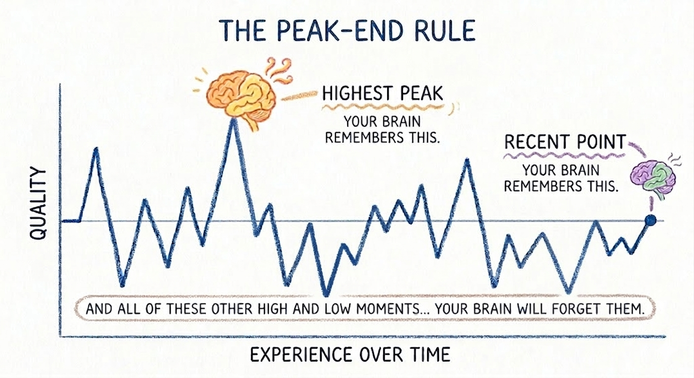
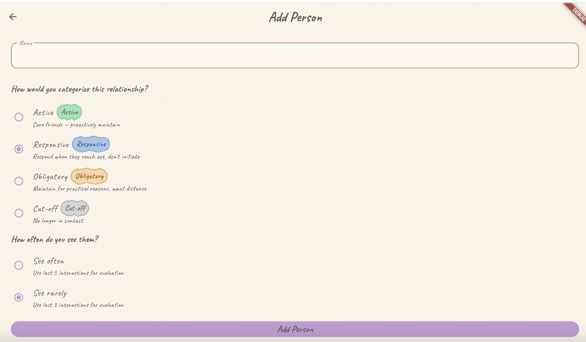
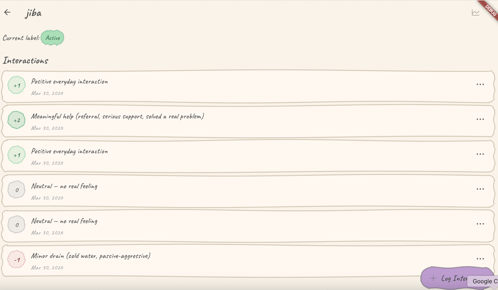
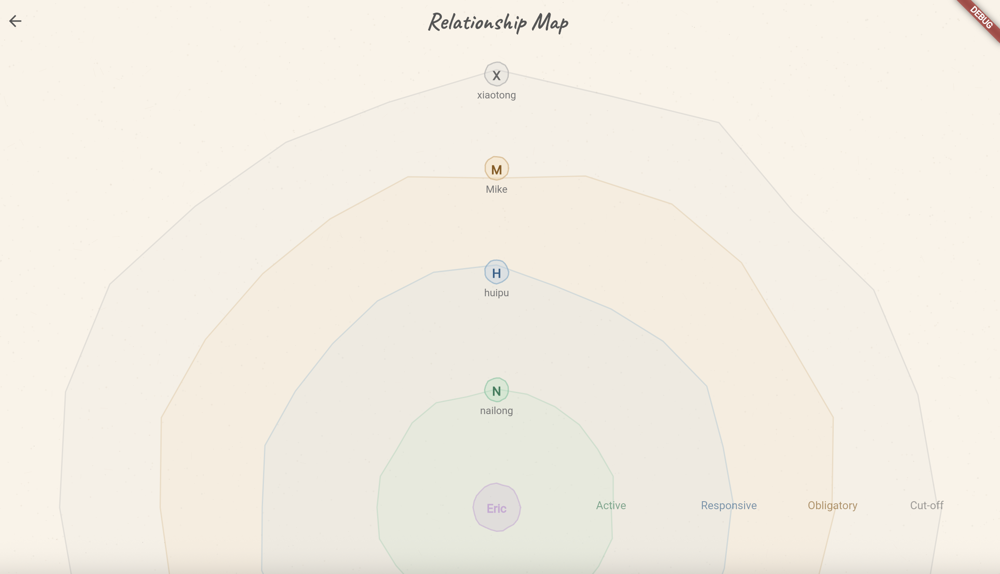
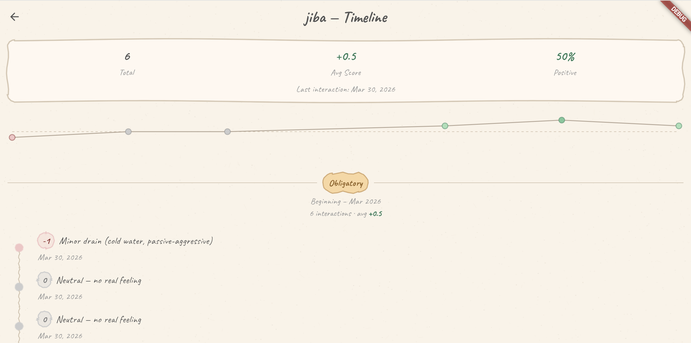

# Closer

> **You can't maintain every relationship the same way. Closer helps you figure out which ones are actually worth your energy.**

Closer gives you a simple system: log how interactions *actually felt*, and the app tells you where each relationship stands. No journaling, no therapy-speak — just honest scores and a clear picture.

---

## Why Your Brain Gets Relationships Wrong

**The Peak-End Rule** (Kahneman, 1993)

Your brain doesn't store a fair average of a relationship. It only remembers two things:
- **The highest emotional peak** — that time they really showed up for you, or really let you down
- **The most recent interaction** — how things felt the last time you talked

Everything in between? Mostly forgotten.

This is why you can have 20 good interactions with someone, one bad one at the end, and walk away feeling like the relationship is worse than it is. Or vice versa.

Closer accounts for this by weighting your **recent window of interactions** — not your entire history — when evaluating where a relationship currently stands.

---

## What It Looks Like

### Add someone & set the context

Pick a relationship type and how often you see them. This affects how the app evaluates your recent interactions — someone you see weekly is held to a different standard than an old friend you catch up with once a year.

---

### Log an interaction, score how it felt

After you see someone, log it. Was it draining? Energizing? Neutral? A simple -3 to +3 scale. No long notes required — one tap and you're done. Over time, the pattern becomes obvious.

---

### See where everyone stands — at a glance

Your personal relationship map. You're at the center. The closer someone is to you, the more actively the relationship is working. Outer rings = drifting, fading, or already gone.

---

### Understand a friendship's full arc

One friend's full history — total interactions, average score, % positive, and a sparkline showing how the relationship has shifted over time. Chapters auto-group by relationship label so you can see when things changed.

---

## The Research Behind the Scoring

| Theory | What It Says | How Closer Uses It |
|--------|-------------|-------------------|
| **Social Exchange Theory** — Thibaut & Kelley, 1959 | Every relationship has implicit costs and benefits. People stay when benefits outweigh costs. | Your score reflects this balance. Consistently negative? The relationship is costing you more than it's giving. |
| **Gottman's 5:1 Ratio** — Dr. John Gottman | Thriving relationships have ~5 positive interactions for every 1 negative. | Your scoring window is calibrated around this ratio. An average score above 0 isn't enough — the balance matters. |

→ [Social Exchange Theory — Simply Psychology](https://www.simplypsychology.org/what-is-social-exchange-theory.html)
→ [The Magic Relationship Ratio — Gottman Institute](https://www.gottman.com/blog/the-magic-relationship-ratio-according-science/)

---

## Tech Stack

| Layer | Technology |
|-------|-----------|
| Framework | Flutter (Dart) |
| Backend | Supabase (PostgreSQL + Auth) |
| State Management | Riverpod 2.6 |
| Routing | go_router 14.6 |
| UI / Theme | Material 3 + Google Fonts (Caveat) + Phosphor Icons |
| Notifications | flutter_local_notifications |
| Auth | Supabase passwordless (OTP) |
